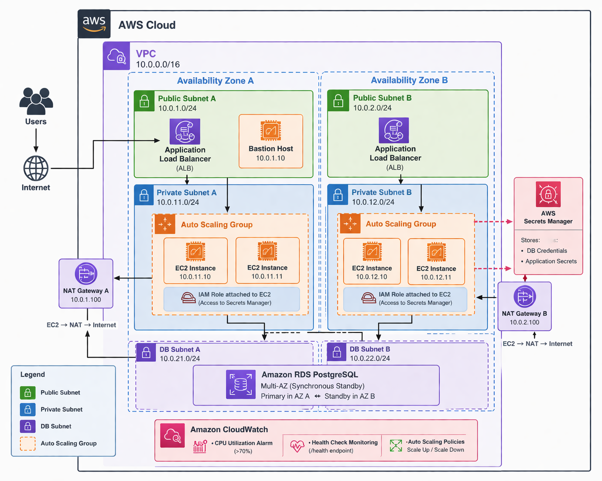

# DevSecOps Terraform Infrastructure (AWS)

## Overview

This project provisions a **production-grade AWS infrastructure** using Terraform, following best practices used by AWS Solutions Architects.

It implements:

* Multi-AZ architecture
* High availability
* Private networking for application and database
* Bastion host for secure access
* AWS Secrets Manager integration
* Auto Scaling Group with Application Load Balancer
* Infrastructure as Code (IaC)

---

## Architecture

The infrastructure includes:

* VPC with public and private subnets across 2 Availability Zones
* Application Load Balancer (ALB)
* Auto Scaling Group (ASG)
* EC2 instances in private subnets
* Bastion Host in public subnet
* RDS PostgreSQL (Multi-AZ)
* NAT Gateways for outbound internet access
* VPC Endpoints (S3, Secrets Manager)

---

## Application Layer

EC2 instances run a simple web application configured via user data.

Components:

* Amazon Linux 2
* Apache (httpd)
* Startup script
* Health endpoint: `/health`

The application securely retrieves secrets from AWS Secrets Manager at runtime.

---

## Design Decisions

* **RDS PostgreSQL** → suitable for relational workloads, managed, Multi-AZ support
* **Not DynamoDB** → this project simulates a traditional backend
* **Amazon Linux 2** → optimized for AWS, fast boot, easy automation
* **ALB + ASG** → load balancing + automatic scaling
* **Private subnets** → improved security, no direct public access

---

## Challenges & Solutions

* **Remote Backend issue** → solved via bootstrap (S3 + DynamoDB)
* **NAT Gateway routing** → enabled internet for private instances
* **Security Groups (RDS)** → restricted access to EC2 only
* **Secrets Manager access** → fixed with IAM role permissions

---

## Security & Scaling

* Secrets stored in AWS Secrets Manager (DB credentials)
* EC2 instances use IAM roles (no hardcoded secrets)
* SSH access only via Bastion Host
* No public access to EC2 or RDS

### Auto Scaling:

* Scale up → CPU > 70%
* Scale down → CPU < 30%

---

## Monitoring

* CloudWatch Alarms (CPU usage)
* Health checks via `/health`
* Auto Scaling policies

---

## Tech Stack

* Terraform
* AWS (VPC, EC2, RDS, ALB, IAM, CloudWatch)
* Amazon Linux 2

---

##  How to Run

### 1. Bootstrap (create backend)

```bash
cd bootstrap
terraform init
terraform apply
```

### 2. Main infrastructure

```bash
cd ../infra
terraform init
terraform apply
```

---

## Outputs

* ALB DNS → access to application
* RDS endpoint → database connection

---

## Goal

This project is part of my **DevOps / Cloud Engineer portfolio**.

It demonstrates:

* Real-world AWS architecture
* Infrastructure as Code
* Secure and scalable design

---

## Roadmap

* Kubernetes (EKS)
* CI/CD (GitHub Actions)
* Prometheus + Grafana monitoring
* AWS WAF
* Terraform Cloud

---

## Architecture Diagram



---

## Architecture Principles

This infrastructure is designed based on real-world production principles:

High Availability → Multi-AZ deployment
Fault Tolerance → Auto Scaling + Load Balancer
Security First → Private subnets, IAM roles, no public EC2
Scalability → Horizontal scaling via ASG
Observability → CloudWatch monitoring and health checks

## Infrastructure Design Pattern

This project follows a 3-tier architecture:

Presentation Layer → ALB
Application Layer → EC2 (ASG)
Data Layer → RDS PostgreSQL

This separation ensures scalability, maintainability, and security.


## Author

* GitHub: https://github.com/YOUR_USERNAME
* LinkedIn: https://linkedin.com/in/YOUR_NAME
* Telegram: https://t.me/YOUR_USERNAME
