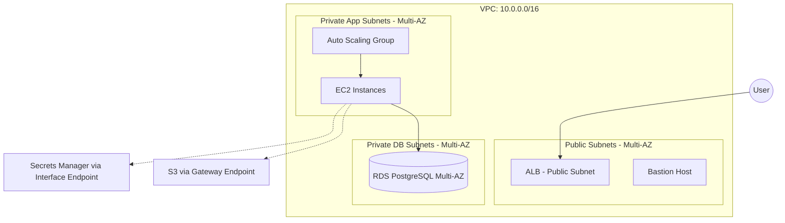

# ⚡️ Production-Ready AWS Infrastructure with Terraform

[](https://www.terraform.io/)
[](https://aws.amazon.com/)
[](https://github.com/max-dev-loreal)
[](https://opensource.org/licenses/MIT)

## 📖 Overview

This project serves as a **Reference Architecture** for a fault-tolerant and secure cloud environment on AWS. The primary objective is not just resource provisioning, but demonstrating the principles of **Self-Healing Infrastructure**, **Network Isolation**, and **Least Privilege Access**.

The project implements a full Three-Tier design, ready for production-level workloads and aligned with the **AWS Well-Architected Framework** standards.

---

## 🏗 Architecture & Design

### High-Level Diagram


### Key Engineering Decisions
* **Zero Public Exposure:** All compute resources (EC2) and databases (RDS) are located in isolated private subnets. External access is strictly controlled via the ALB (HTTP/HTTPS) or the Bastion Host (SSH).
* **High Availability (Multi-AZ):** The infrastructure is distributed across two Availability Zones. In the event of an AWS data center failure, the system maintains continuity.
* **Scalability:** Implemented dynamic auto-scaling based on CPU utilization to handle fluctuating traffic demands.
* **Security First:** * No secrets are stored in the codebase; AWS Secrets Manager is utilized for dynamic credential retrieval.
    * Use of IAM Roles & Instance Profiles instead of static access keys.
    * Network Isolation: Inter-component traffic is restricted at the Security Group level.

---

## 🛠 Tech Stack

* **IaC:** Terraform (Modular structure)
* **Cloud:** AWS (VPC, EC2, ASG, ALB, RDS, CloudWatch, IAM)
* **OS/Web:** Amazon Linux 2, Apache (httpd)
* **Database:** PostgreSQL (RDS)
* **Security:** AWS Secrets Manager, VPC Endpoints

---

## 🚀 Deployment Guide

### Prerequisites
* Terraform v1.5.0+
* AWS CLI configured with appropriate permissions
* S3 Bucket for Terraform State storage (created during the Bootstrap phase)

### 1. Provisioning Remote State
Deploy the backend (S3 & DynamoDB) to securely store the state and enable state locking.
```bash
cd bootstrap
terraform init
terraform apply -auto-approve
```

### 2. Main Infrastructure
```bash
cd ../infra
terraform init
terraform apply -auto-approve
```

---

## 🔐 Security Controls

| Feature | Implementation |
| :--- | :--- |
| **Network Security** | Custom VPC, Public/Private subnets, NAT Gateways |
| **Access Control** | Bastion Host (Jump Box) + Security Groups |
| **Identity** | IAM Roles with Principle of Least Privilege |
| **Data Protection** | RDS Multi-AZ Failover + Encrypted Storage |
| **Secrets Management** | AWS Secrets Manager with dynamic fetching |

---

## 📈 Observability & Reliability

* **Self-Healing:** The ASG automatically replaces unhealthy instances based on ALB health checks.
* **Monitoring:** CloudWatch Alarms are configured for critical resource thresholds.
* **Scaling Policy:**
    * **Scale-Out:** +1 instance when CPU > 70% for 2 minutes.
    * **Scale-In:** -1 instance when CPU < 30%.

---

## 🗺 Roadmap

- [ ] Integrate **AWS WAF** for SQLi and XSS protection.
- [ ] Transition to **Amazon EKS (Kubernetes)** for container orchestration.
- [ ] Implement **GitHub Actions** (CI/CD) for automated Terraform Plan/Apply workflows.
- [ ] Set up advanced monitoring with **Prometheus + Grafana**.

---

## 👤 Author

**Max Dev** — Cloud & DevSecOps Enthusiast.

[](https://github.com/max-dev-loreal)
[](https://youtu.be/pV7I0Aw345I)

---
*This project is built for educational purposes to demonstrate distributed systems behavior.*
