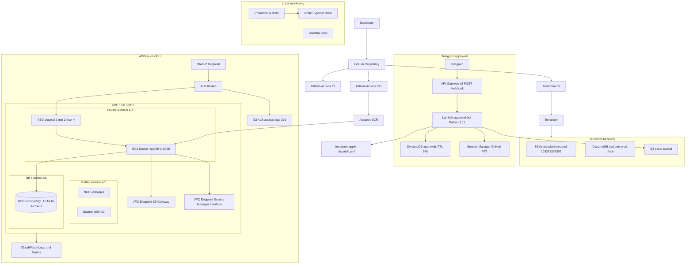

# High-Availability Status Page Platform

Deploy a Flask-based status page on AWS with Docker, Terraform, multi-AZ infrastructure, autoscaling, WAF, Telegram approvals for Terraform plans, and GitHub Actions CI/CD.

## Screenshots

### Status Page


### Grafana Dashboard


## Architecture


```mermaid
flowchart TB
  dev[Developer] --> gh[GitHub Repository]
  gh --> ci[GitHub Actions CI]
  gh --> cd[GitHub Actions CD]
  gh --> tfci[Terraform CI]
  cd --> ecr[Amazon ECR]
  tfci --> tf[Terraform]

  subgraph backend[Terraform backend]
    s3state[S3 tfstate-platform-prod-103242399399]
    ddbLock[DynamoDB platform-prod-tflock]
    s3plans[S3 plans bucket]
  end

  tf --> backend

  subgraph approvals[Telegram approvals]
    tg[Telegram]
    apigw[API Gateway v2 POST /webhook]
    lambda[Lambda approval-bot Python 3.11]
    ddbApprovals[DynamoDB approvals TTL 24h]
    pat[Secrets Manager GitHub PAT]
  end

  tg --> apigw --> lambda
  lambda --> ddbApprovals
  lambda --> s3plans
  lambda --> pat
  lambda --> dispatch[terraform-apply-dispatch.yml]

  subgraph aws[AWS eu-north-1]
    waf[WAFv2 Regional]
    alb[ALB 80/443]

    subgraph vpc[VPC 10.0.0.0/16]
      subgraph public[Public subnets a/b]
        nat[NAT Gateways]
        bastion[Bastion SSH 22]
      end

      subgraph private[Private subnets a/b]
        asg[ASG desired 2 min 2 max 4]
        ec2[EC2 Docker app 80 to 8000]
      end

      subgraph db[DB subnets a/b]
        rds[(RDS PostgreSQL 15 Multi-AZ 5432)]
      end

      s3endpoint[VPC Endpoint S3 Gateway]
      smendpoint[VPC Endpoint Secrets Manager Interface]
    end

    cw[CloudWatch Logs and Alarms]
    albLogs[S3 ALB access logs 30d]
  end

  ecr --> ec2
  waf --> alb --> asg --> ec2 --> rds
  ec2 --> s3endpoint
  ec2 --> smendpoint
  vpc --> cw
  alb --> albLogs

  subgraph local[Local monitoring]
    prom[Prometheus 9090]
    grafana[Grafana 3000]
    node[Node Exporter 9100]
  end

  prom --> node
```

## Repository structure

```text
.
├── app/                    # Flask app, Dockerfile, Gunicorn, tests, Alembic
├── bootstrap/              # S3 backend, S3 plans bucket, DynamoDB lock table
├── bot/                    # Telegram approval Lambda
├── infra/                  # Terraform root module and AWS modules
├── monitoring/             # Prometheus, Grafana, Node Exporter
├── nginx/                  # Local nginx reverse proxy
├── .github/workflows/      # CI/CD and Terraform checks
├── docker-compose.yml
├── docker-compose.prod.yml
└── Makefile
```

## Prerequisites

| Tool           |   Version | Purpose                                                    |
| -------------- | --------: | ---------------------------------------------------------- |
| Docker         |   `>= 24` | Build and run the application container                    |
| Docker Compose |    `>= 2` | Run the local app/nginx stack and monitoring stack         |
| Python         |    `3.11` | Develop the Flask app and Lambda approval bot              |
| Terraform      |  `>= 1.6` | Provision AWS infrastructure                               |
| AWS CLI        |    `>= 2` | Access AWS, authenticate to ECR, and bootstrap the backend |
| GitHub CLI     |    `>= 2` | Optional: inspect workflow runs from the CLI               |
| TFLint         | `>= 0.50` | Lint Terraform locally and in CI                           |
| Checkov        |    `>= 3` | IaC security scanning                                      |
| GNU Make       |    `>= 4` | Run `make lint`, `make test`, and `make build`             |
| curl           |    `>= 8` | Run container health checks and smoke tests                |

## Environment variables and Terraform variables

### App

| Variable       | Required | Default         | Description                                            |
| -------------- | -------: | --------------- | ------------------------------------------------------ |
| `APP_VERSION`  |       No | Not set         | Application version displayed on `/` and `/api/status` |
| `DEPLOY_TIME`  |       No | Not set         | Deployment timestamp displayed on `/`                  |
| `ENVIRONMENT`  |       No | Not set         | Environment name, for example `local` or `prod`        |
| `DATABASE_URL` |       No | SQLite fallback | SQLAlchemy connection string; `/ready` runs `SELECT 1` |
| `LOG_LEVEL`    |       No | Not set         | Application log level                                  |

### Terraform

| Variable                | Required | Default       | Description                                                             |
| ----------------------- | -------: | ------------- | ----------------------------------------------------------------------- |
| `region`                |      Yes | `eu-north-1`  | AWS region                                                              |
| `instance_type`         |      Yes | Not set       | EC2 instance type for application instances                             |
| `db_instance_class`     |       No | `db.t3.micro` | RDS PostgreSQL instance class                                           |
| `ami_id`                |      Yes | Not set       | AMI for the Launch Template and bastion host                            |
| `key_name`              |      Yes | Not set       | EC2 key pair for SSH through the bastion host                           |
| `db_password`           |      Yes | Not set       | Master password stored in `rds-master-credentials-${env}-v2`            |
| `certificate_arn`       |       No | Empty         | ACM certificate ARN; enables HTTPS 443 and HTTP→HTTPS redirect when set |
| `telegram_bot_token`    |      Yes | Not set       | Telegram bot token for the approval webhook                             |
| `telegram_chat_id`      |      Yes | Not set       | Allowed Telegram chat ID for callback approvals                         |
| `github_pat_secret_arn` |      Yes | Not set       | Secrets Manager ARN containing the GitHub PAT                           |
| `github_owner`          |      Yes | Not set       | GitHub organization or user for the dispatch workflow                   |
| `github_repo`           |      Yes | Not set       | GitHub repository for the dispatch workflow                             |
| `app_image_tag`         |      Yes | Not set       | Docker image tag deployed on EC2                                        |

### Telegram approval bot Lambda

| Variable                | Required | Default                              | Description                                    |
| ----------------------- | -------: | ------------------------------------ | ---------------------------------------------- |
| `GITHUB_OWNER`          |      Yes | Terraform `github_owner`             | GitHub owner used for GitHub API dispatch      |
| `GITHUB_REPO`           |      Yes | Terraform `github_repo`              | GitHub repository used for GitHub API dispatch |
| `GITHUB_PAT_SECRET_ARN` |      Yes | Terraform `github_pat_secret_arn`    | Secret ARN containing the GitHub PAT           |
| `TELEGRAM_CHAT_ID`      |      Yes | Terraform `telegram_chat_id`         | Only allowed Telegram chat ID                  |
| `PLANS_S3_BUCKET`       |      Yes | Bootstrap/Terraform output           | S3 bucket containing `plans/{run_id}/tfplan`   |
| `DYNAMODB_TABLE`        |      Yes | Terraform `lambda_bot` module output | Approvals table with 24-hour TTL               |

### Monitoring `.env`

| Variable               | Required | Default | Description                                                  |
| ---------------------- | -------: | ------- | ------------------------------------------------------------ |
| Grafana admin password |      Yes | Not set | Grafana administrator password loaded from `monitoring/.env` |

## Deployment

### Local

1. Create the application `.env` file:

```bash
cat > .env <<'EOF'
APP_VERSION=local
DEPLOY_TIME=local
ENVIRONMENT=local
LOG_LEVEL=INFO
# Leave DATABASE_URL unset to use the SQLite fallback
EOF
```

2. Start the application and nginx:

```bash
docker compose up --build -d
```

3. Check the endpoints:

```bash
curl -fsS http://localhost/health
curl -fsS http://localhost/ready
curl -fsS http://localhost/api/status
curl -fsS http://localhost/metrics
```

4. Run tests and linters:

```bash
make lint
make test
```

5. Stop the local stack:

```bash
docker compose down
```

### Production

1. Validate AWS credentials:

```bash
aws sts get-caller-identity
```

2. Create the backend for Terraform state and plans:

```bash
cd bootstrap
terraform init
terraform plan
terraform apply
```

The backend creates S3 bucket `tfstate-platform-prod-103242399399`, an S3 plans bucket with a 7-day lifecycle policy, and DynamoDB table `platform-prod-tflock`.

3. Initialize the production infrastructure:

```bash
cd ../infra
terraform init
terraform workspace select default
terraform fmt -check
terraform validate
tflint
checkov -d . --soft-fail
```

4. Create `terraform.tfvars`:

```hcl
region                = "eu-north-1"
instance_type         = "<ec2-instance-type>"
db_instance_class     = "db.t3.micro"
ami_id                = "<ami-id>"
key_name              = "<ec2-key-pair>"
db_password           = "<rds-master-password>"
certificate_arn       = "<acm-certificate-arn>"
telegram_bot_token    = "<telegram-bot-token>"
telegram_chat_id      = "<telegram-chat-id>"
github_pat_secret_arn = "<github-pat-secret-arn>"
github_owner          = "<github-owner>"
github_repo           = "<github-repo>"
app_image_tag         = "<image-tag>"
```

5. Run plan and apply:

```bash
terraform plan -out=tfplan
terraform apply tfplan
```

The production CI/CD flow runs through GitHub Actions:

1. `ci.yml`: `flake8`, `black`, `isort`, `pytest --cov`, Docker build, container healthcheck against `/health`, and PR comment.
2. `cd.yml`: build and push to ECR through OIDC, tag images with `github.sha` and `latest`, and send Telegram notifications.
3. `terraform-ci.yml`: run `terraform fmt -check`, `terraform validate`, `tflint`, and `checkov --soft-fail` for changes in `infra/**` and `bootstrap/**`.
4. The Telegram bot validates `chat_id`, callback age `<60 min`, DynamoDB idempotency, `plans/{run_id}/tfplan` in S3, and dispatches `terraform-apply-dispatch.yml`.
5. Destroy requires double confirmation: `run_id|destroy|confirmed`.

## App endpoints

| Endpoint          | Purpose                                                                               |
| ----------------- | ------------------------------------------------------------------------------------- |
| `GET /`           | HTML status page: uptime, version, environment, deploy time                           |
| `GET /health`     | Liveness probe returning JSON `status` and `timestamp`                                |
| `GET /ready`      | Readiness probe running DB `SELECT 1`; returns `503` when the database is unavailable |
| `GET /metrics`    | Prometheus metrics                                                                    |
| `GET /api/status` | JSON overview: `statuspage`, `bot`, `database`, version, environment, uptime          |

## Monitoring and logging

### Metrics and ports

| Component           |   Endpoint/port | Metrics                                                                                    |
| ------------------- | --------------: | ------------------------------------------------------------------------------------------ |
| Flask app           | `:8000/metrics` | `statuspage_requests_total{method,endpoint,status}`, `statuspage_request_duration_seconds` |
| nginx local         |           `:80` | Reverse proxy to `app:8000`; `/health` is excluded from `access_log`                       |
| Prometheus local    |         `:9090` | Scrape `node-exporter:9100`                                                                |
| Grafana local       |         `:3000` | Dashboards; admin password from `monitoring/.env`                                          |
| Node Exporter local |         `:9100` | Host metrics for Prometheus                                                                |
| ALB target group    |    `:80/health` | Healthcheck targets in ASG                                                                 |
| RDS PostgreSQL      |         `:5432` | Accessible only from the `app_private` security group                                      |

### Logs

| Source              | Destination / purpose                                               |
| ------------------- | ------------------------------------------------------------------- |
| Flask/Gunicorn      | stdout/stderr Docker container logs                                 |
| nginx local         | access/error logs; `/health` is excluded from access logs           |
| ALB                 | S3 access logs with a 30-day lifecycle policy                       |
| VPC Flow Logs       | CloudWatch Logs                                                     |
| Lambda approval bot | CloudWatch Logs                                                     |
| GitHub Actions      | Workflow run logs                                                   |
| Telegram            | Success/failure notifications with a link to the GitHub Actions run |

## Security checklist

- EC2 application instances run in private subnets and have no public IP addresses.
- Bastion host is the only SSH entry point and is CIDR-restricted.
- NAT Gateway is used only for outbound traffic from private subnets.
- VPC Endpoints for S3 and Secrets Manager keep traffic on the AWS network path.
- EBS gp3 volumes, RDS, and S3 are encrypted.
- WAFv2 uses AWS Managed Rules: CommonRuleSet, KnownBadInputs, SQLi, and rate limit `2000 req / 5 min / IP`.
- IAM follows least privilege: EC2 reads only required secrets and ECR layers; Lambda accesses only its S3, DynamoDB, and Secrets Manager resources.
- Docker image is built with a multi-stage Dockerfile, runs as non-root user `appuser`, and includes a `/health` healthcheck.
- IaC is checked with TFLint and Checkov in CI.

## Useful commands

```bash
make build
make up
make test
make lint
cd infra && terraform fmt -check && terraform validate && tflint && checkov -d . --soft-fail
```
